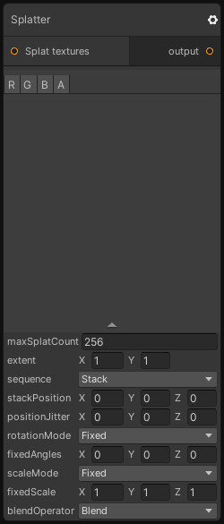

# Splatter

## Inputs
Port Name | Description
--- | ---
Splat textures | 

## Output
Port Name | Description
--- | ---
output | 

## Description
Distribute a set of input textures based on parameter-based patterns.
Most of the settings of this node are available in the inspector so don't hesitate to pin the node and tweak the parameters until you achieve your goal.

Note that when you connect multiple textures in the "Splat Textures" port, they will be randomly selected at each splat operation.
The limit of different input textures you can connect is 16, after new textures will be ignored.

