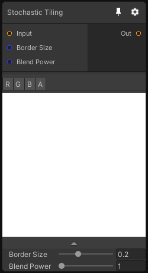

# Stochastic Tiling

## Inputs
Port Name | Description
--- | ---
Input | 
Border Size | 
Blend Power | 

## Output
Port Name | Description
--- | ---
Out | 

## Description
Make a texture tile following the stochastic method described in this paper: https://drive.google.com/file/d/1QecekuuyWgw68HU9tg6ENfrCTCVIjm6l/view

Please note that this node only support Texture2D dimension(s).
