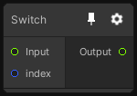

# Switch

## Inputs
Port Name | Description
--- | ---
index | 
Input | 

## Output
Port Name | Description
--- | ---
Output | 

## Description
Conditionally select the input using the index and output it.

