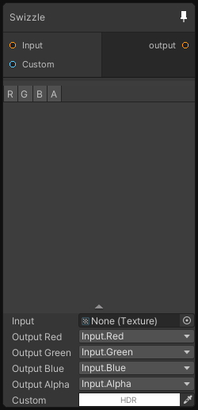

# Swizzle

## Inputs
Port Name | Description
--- | ---
Input | 
Custom | 

## Output
Port Name | Description
--- | ---
output | 

## Description
Swizzle the channels of the input texture, you can also choose to put a custom value instead of reusing a channel.

