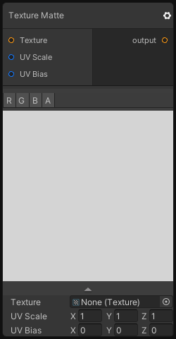

# Texture Matte

## Inputs
Port Name | Description
--- | ---
Texture | 
UV Scale | 
UV Bias | 

## Output
Port Name | Description
--- | ---
output | 

## Description
Sample a Texture with a scale and a bias on the UVs.
This node can be useful to check if a texture is tiling by putting the scale to 2.

