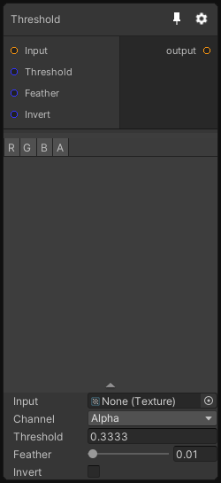

# Threshold

## Inputs
Port Name | Description
--- | ---
Input | 
Threshold | 
Feather | Smooth the treshold step
Invert | 

## Output
Port Name | Description
--- | ---
Out | 

## Description
Apply a threshold value to a channel of the input texture and output the result. You can use the Feather parameter to smooth the step.

