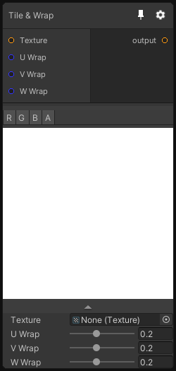

# Tile & Wrap

## Inputs
Port Name | Description
--- | ---
Texture | 
U Wrap | 
V Wrap | 
W Wrap | 

## Output
Port Name | Description
--- | ---
Out | 

## Description
Make the input texture tile by wrapping and blending the borders of the texture.

Please note that this node only support Texture2D and Texture3D dimension(s).
