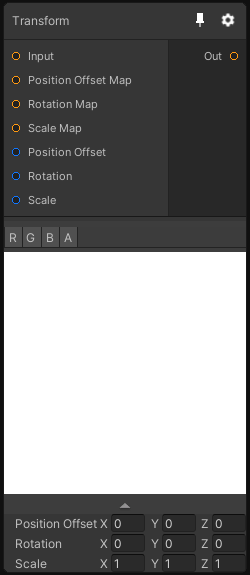

# Transform

## Inputs
Port Name | Description
--- | ---
Input | 
Position Offset Map | 
Rotation Map | The rotation is stored in the X, Y and Z channels. A value of 1 means 360 degree.
Scale Map | 
Position Offset | 
Rotation | Rotation in euler angles between 0 and 360
Scale | 

## Output
Port Name | Description
--- | ---
Out | 

## Description
Apply a transformation on the input texture. This node allows you to offset, scale and rotate the input texture based on either another texture or a constant.

Note that the values from the rotation map will be converted to euler angles in the node so that 1 means 360 degree.

