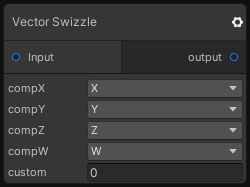

# Vector Swizzle

## Inputs
Port Name | Description
--- | ---
Input | 

## Output
Port Name | Description
--- | ---
output | 

## Description
Swizzle the input vector, you can also choose tou output a custom value instead of a vector component.

